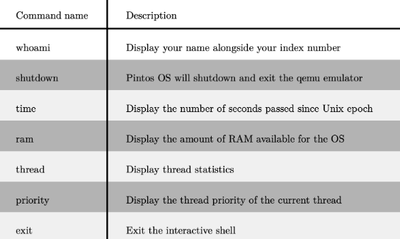
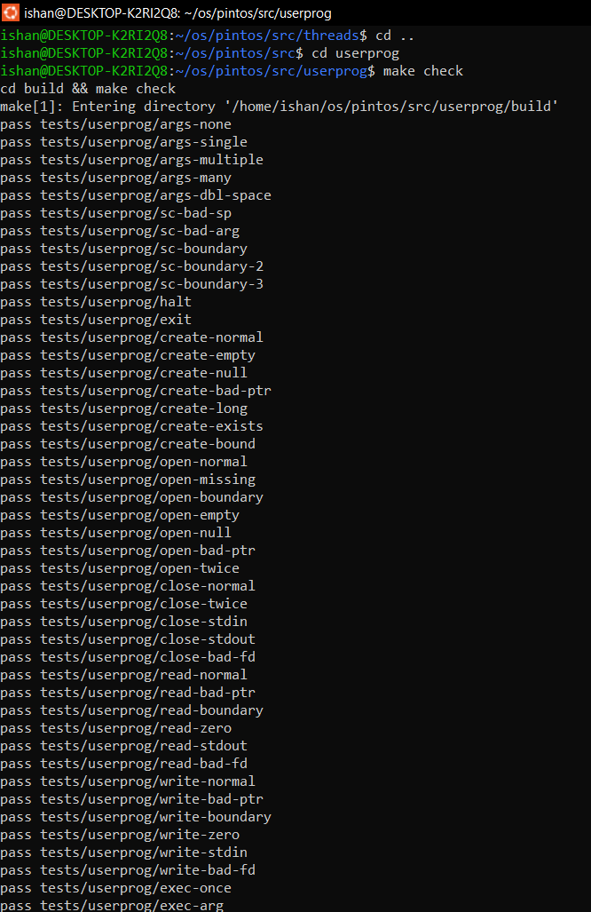
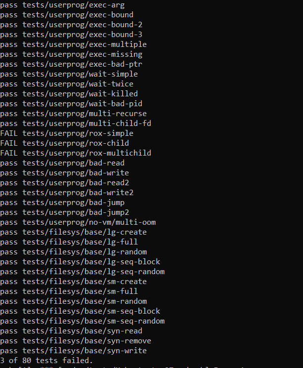

<h1 align="center"> Pintos Operating System</h1>
<p align="center"><i>Implementing educational operating system</i></p>
As part of the <b>CS2043 - Operating Systems</b> module, I worked on a project involving the  <a href="https://web.stanford.edu/class/cs140/projects/pintos/pintos_1.html">Pintos</a> teaching operating system, which is designed for the 80x86 architecture. Pintos is a simple and small OS, making it ideal for educational purposes. Despite its simplicity, it supports essential OS concepts such as kernel threads, virtual memory, user programs, and file systems. However, its initial implementations are often incomplete or underdeveloped. My task was to enhance these existing systems, which I accomplished in two Labs.

## Lab 01 : Implementing the Thread System 

In this part of the project, I started with a minimally functional thread system. My task was to expand this system's capabilities to gain a deeper understanding of synchronization issues. The primary focus was on the threads directory, with some additional work in the devices directory. Compilation of the project was performed within the threads directory.

To achieve this, I used various synchronization techniques, including semaphores, locks, monitors, and interrupt handling. These techniques were crucial in managing concurrency and ensuring that threads operated correctly without conflicts or data inconsistencies.

The below table lists the functions that the shell should support, along with a brief description of their intended purposes.



You can see in the following screenshots how my developed operating system works for those commands giving the system information of the machine. If you are also supposed to use this project, make sure to change the name in the **'init.c'** file.


## Lab 2: Enable programs to interact with the OS via system calls.

The base code already supports loading and running user programs, but no I/O or interactivity is possible. In this step, I enabled programs to interact with the OS via system calls. For this part of the project, I primarily worked in the 'userprog' directory, but the task required interacting with almost every other part of Pintos.

Previously, all the code ran as part of the operating system kernel, giving test code full access to privileged system parts. Running user programs changes this dynamic. This project addressed the challenges of allowing multiple processes to run simultaneously, each with a single thread. User programs operate under the illusion that they have the entire machine, so it is crucial to manage memory, scheduling, and other states correctly to maintain this illusion.

Unlike the previous part, where test code was compiled directly into the kernel requiring specific function interfaces, this step involved testing the OS by running user programs.

In the following screenshot, you can see how my developed OS performs with the built-in test cases. You can also check the extent to which my implementation supports running user programs.




## Running Locally

Clone the project

```bash
  git clone https://github.com/Ishdew/Pintos-Operating-System
```

Go to the project directory

```bash
  cd pintos/src/threads
  make
  cd build
  pintos --
```


# Contribute

Contributions are always welcome!

##  License :pencil:

This project is licensed under [MIT](https://opensource.org/licenses/MIT) license.

## Show your support 🙏

Give a ⭐️ if this project helped you!